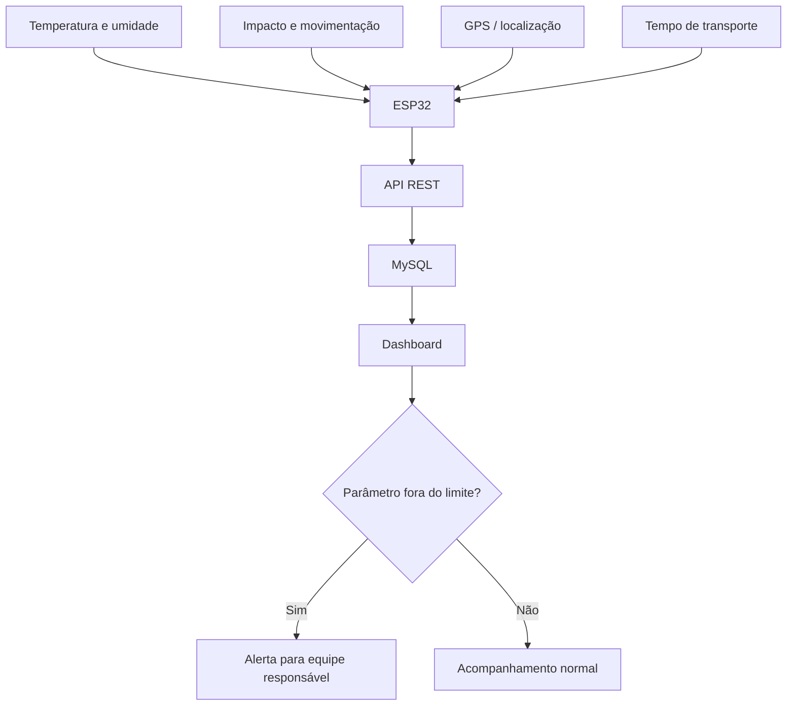

<p align="center"></p>

# LifeBox — Transporte Inteligente de Órgãos

Solução acadêmica de IoT para monitorar as condições de uma caixa térmica durante o transporte de órgãos, reunindo sensores, rastreabilidade e acompanhamento remoto em um único fluxo.

## Problema

O transporte de órgãos exige controle rigoroso das condições ao longo do trajeto. Alterações de temperatura, impactos, atrasos ou perda de rastreabilidade podem aumentar o risco operacional e dificultar a tomada de decisão pelas equipes responsáveis.

## Solução

A LifeBox propõe uma caixa térmica inteligente equipada com sensores e conectividade para acompanhar temperatura, umidade, movimentação, localização e tempo de transporte. Os dados são enviados para uma aplicação de monitoramento, permitindo histórico, indicadores e alertas quando algum parâmetro sair dos limites definidos.



## Monitoramento previsto

| Dado | Objetivo |
|---|---|
| Temperatura | Identificar variações térmicas durante o trajeto |
| Umidade | Acompanhar as condições internas da caixa |
| Impactos e movimentação | Registrar quedas ou movimentos bruscos |
| Localização | Permitir rastreabilidade do transporte |
| Tempo de transporte | Acompanhar a duração e possíveis atrasos |

## Arquitetura planejada

`Sensores → ESP32 → API REST → MySQL → Dashboard → Alertas`

A implementação será incremental. O software poderá ser validado inicialmente com dados simulados antes da integração completa com os componentes físicos.

## Tecnologias planejadas

### Hardware
- ESP32
- DHT22 ou sensor equivalente de temperatura e umidade
- MPU6050 para aceleração, inclinação e movimentação
- GPS NEO-6M para latitude e longitude
- Wi-Fi para conectividade no MVP

### Software
- Node.js
- Express
- MySQL
- HTML
- CSS
- JavaScript
- API REST

## Diferenciais

- aplicação de IoT em um processo crítico da área da saúde;
- monitoramento de múltiplas condições em uma única solução;
- histórico das leituras para rastreabilidade;
- arquitetura separando sensores, API, banco e visualização;
- possibilidade de alertas baseados em parâmetros definidos;
- evolução futura para conectividade móvel e acompanhamento em trânsito.

## Indicadores para um piloto

| Indicador | Decisão apoiada |
|---|---|
| Leituras fora dos limites | Identificar ocorrências críticas |
| Tempo total de transporte | Acompanhar duração do trajeto |
| Quantidade de impactos registrados | Avaliar condições de manuseio |
| Intervalo entre atualizações | Verificar regularidade do monitoramento |
| Disponibilidade do sistema | Medir continuidade do acompanhamento |

> Os indicadores estão definidos como parte do projeto, mas resultados numéricos só serão apresentados após testes e coleta de dados.

## Estrutura atual

```text
├── assets/
│   ├── cover.svg
│   └── lifebox-logo.svg
├── docs/
│   ├── architecture.md
│   ├── database.md
│   └── hardware.md
├── .gitignore
└── README.md
```

## Status do projeto

🚧 **Em desenvolvimento**

O projeto está na fase inicial de definição da arquitetura e do MVP. As próximas implementações serão adicionadas ao repositório conforme o avanço do trabalho acadêmico.

## Próximos passos

- definir os limites e regras de alerta do protótipo;
- criar a API REST;
- modelar e implementar o banco MySQL;
- desenvolver um simulador de leituras;
- construir o dashboard de monitoramento;
- integrar ESP32 e sensores;
- validar o GPS em ambiente externo;
- registrar testes e evidências visuais do protótipo.

## Documentação

- [Arquitetura](docs/architecture.md)
- [Hardware planejado](docs/hardware.md)
- [Modelo inicial de dados](docs/database.md)

## Autor

**Sandro Ferreira** — estudante de Engenharia da Computação e de Inteligência Artificial e Automação Digital.

[LinkedIn](https://linkedin.com/in/sandrozdb) · [GitHub](https://github.com/sandrozdb)

---

## MVP funcional atual

<div align="center">

# LIFEBOX

### Transporte Inteligente de Órgãos · MVP acadêmico

**Telemetria simulada · Alertas · Rastreabilidade · Dashboard local**

</div>

> **Aviso:** o MVP atual utiliza sensores, rota e instituições simulados. A arquitetura foi preparada para que a fonte simulada seja posteriormente substituída por um ESP32 e sensores físicos. Os limites são demonstrativos e deverão ser definidos com base em protocolo médico e requisitos regulatórios. Este projeto não é um dispositivo médico certificado e não confirma preservação clínica.

## Visão do produto

A LifeBox demonstra uma arquitetura de monitoramento de condições e rastreabilidade durante um transporte crítico. O protótipo permite observar temperatura, umidade, movimento, impacto, localização, velocidade, bateria e sinal durante uma viagem fictícia.

## Problema e solução proposta

Transportes críticos exigem visibilidade operacional e registro cronológico. Este MVP prova o fluxo técnico de coleta, persistência, regras, alertas e visualização sem inventar resultados físicos ou clínicos.

```text
Simulador de sensores → API REST → MySQL → motor de regras
                                           ↓
                             dashboard + mapa + timeline
```

## Funcionalidades

- dashboard responsivo com atualização automática a cada 2 segundos;
- mapa Leaflet/OpenStreetMap com origem, destino, rota, posição e trajeto;
- fallback offline com coordenadas e progresso;
- gráficos de temperatura, umidade, impacto e bateria;
- alertas persistidos com severidade, valor, cooldown e resolução;
- timeline vinda do banco;
- resumo ao concluir transporte;
- simulador interno controlado pela interface;
- simulador Node.js externo usando o mesmo contrato do futuro ESP32;
- oito cenários de demonstração;
- API validada e queries parametrizadas;
- testes sem dependência de MySQL no CI.

## Cenários

Normal, temperatura crítica progressiva, impacto, umidade alta, bateria baixa progressiva, perda/restabelecimento de sinal, atraso e transporte concluído.

## Integração com as disciplinas

| Disciplina | Aplicação na LifeBox |
|---|---|
| Eletrônica Digital e Analógica | Sensores, interfaces, alimentação e lógica AND/OR para alerta, LED e buzzer futuros |
| Física para Sistemas Computacionais | ΔT, aceleração, potência, energia e autonomia de bateria didática |
| Software Architecture & Design Patterns | Strategy para score de rota e Observer para eventos de alertas |
| Cloud Computing for Software Development | Configuração por ambiente, containers, health check e arquitetura cloud-ready |
| Operations Research | Normalização, restrições e função multiobjetivo para escolha da rota |
| Software Testing & Quality Assurance | Testes automatizados de API, regras, otimização e cálculos físicos |

## Requisitos

- Windows 10/11 com Node.js 18 ou superior;
- MySQL 8;
- VS Code recomendado;
- internet somente para os blocos visuais do mapa OpenStreetMap. O restante funciona localmente.

## Instalação no Windows

```powershell
npm install
Copy-Item .env.example .env
```

Edite `.env` com suas credenciais locais. Nunca envie esse arquivo ao GitHub.

```env
PORT=3000
DB_DRIVER=mysql
DB_HOST=localhost
DB_PORT=3306
DB_USER=root
DB_PASSWORD=sua_senha_local
DB_NAME=lifebox_db
```

Crie e popule o banco:

```powershell
npm run setup-db
```

Inicie o sistema:

```powershell
npm start
```

Acesse [http://localhost:3000](http://localhost:3000).

Alternativa com Docker:

```powershell
docker compose up --build
```

O modo tradicional sem Docker continua suportado.

Durante desenvolvimento:

```powershell
npm run dev
```

## Simulador externo

Com a API ativa em outro terminal:

```powershell
npm run simulator
npm run simulator -- impacto
```

O dashboard já possui seu próprio simulador controlável; o processo externo existe para comprovar a separação entre produtor e backend.

## Banco

- `database/schema.sql`: tabelas e índices.
- `database/seed.sql`: transporte demonstrativo na região de São Paulo.
- Nenhum paciente ou hospital parceiro real é usado.

Consulte [docs/database.md](docs/database.md).

## API e contrato

O produtor envia JSON para `POST /api/telemetria`. Consulte:

- [API REST](docs/api.md)
- [Contrato de telemetria](docs/telemetry-contract.md)
- [Payload de exemplo](firmware/example-payload.json)

## Estrutura

```text
src/           API, serviços, otimização, Física, regras e persistência
simulator/     rota, sensores, cenários e produtor externo
public/        dashboard HTML/CSS/JavaScript
database/      schema e seed MySQL
firmware/      exemplo futuro de ESP32 (não testado em hardware)
tests/         testes principais com repositório em memória
docs/          arquitetura, PO, Física, eletrônica, cloud, QA e apresentação
.github/       workflow de validação
```

## Testes

```powershell
npm run check
npm test
```

São validados: health, transporte, telemetria, alertas, progresso, resumo, normalização, pesos, inviabilidade, empate e fórmulas físicas.

## Modo demonstração

O roteiro completo está em [docs/demo-guide.md](docs/demo-guide.md). Nenhuma edição de código é necessária durante a apresentação.

## Limitações

- sensores e GPS são simulados;
- rota e instituições são fictícias;
- mapa-base depende de internet, embora a rastreabilidade continue sem ele;
- não há autenticação no MVP local;
- limites ainda não foram definidos por especialistas;
- não há certificação, validação clínica ou ensaio físico.

## Próximos passos físicos

1. montar ESP32;
2. integrar sensor térmico/DHT22, MPU6050 e NEO-6M;
3. adaptar o exemplo de firmware;
4. calibrar sensores;
5. definir limites com orientação técnica/médica;
6. adicionar autenticação do dispositivo e HTTPS;
7. testar fisicamente na caixa térmica.

Documentação complementar: [arquitetura](docs/architecture.md), [hardware](docs/hardware.md) e [simulação](docs/simulation.md).
