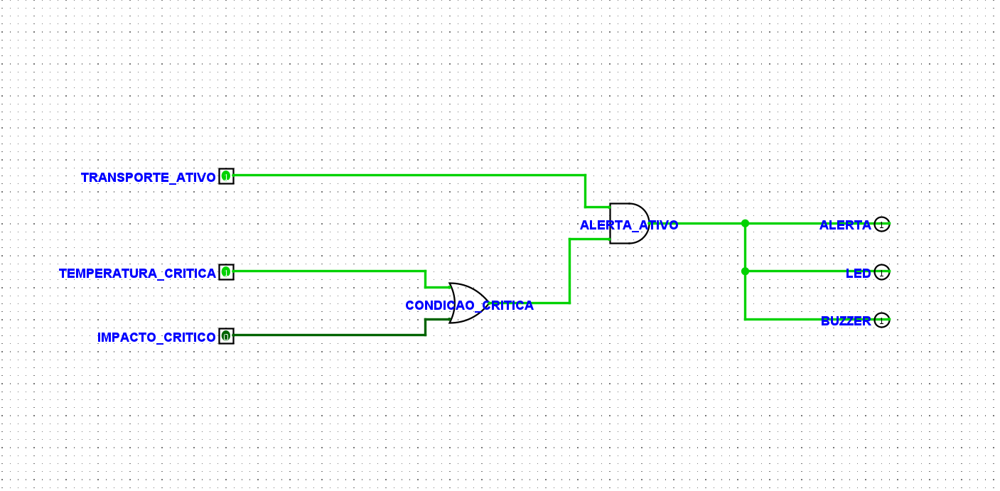
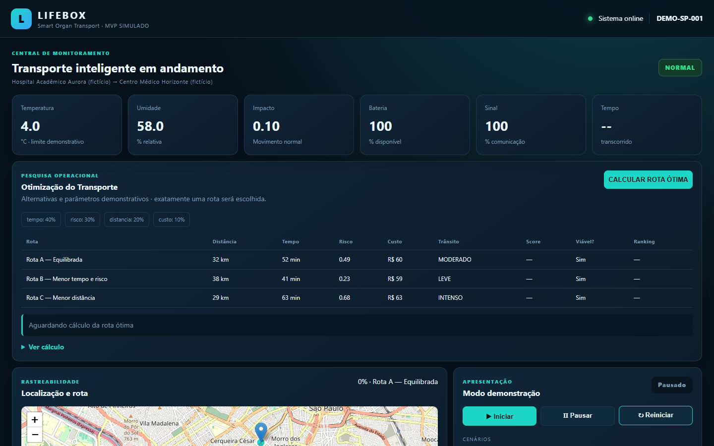

  

# LifeBox — Smart Organ Transport

Plataforma acadêmica de IoT para monitoramento e rastreabilidade do transporte de órgãos. O MVP integra telemetria simulada, alertas, otimização de rota, fundamentos físicos, eletrônica digital, arquitetura de software e dashboard web.

> Aviso acadêmico: sensores, rotas, instituições e limites são simulados ou didáticos. A LifeBox não é um dispositivo médico certificado e não deve ser interpretada como validação clínica ou de preservação de órgãos.

## Visão geral

O dashboard acompanha temperatura, umidade, impacto/movimento, bateria, sinal, localização, velocidade, progresso e tempo de transporte. O sistema também registra alertas e eventos, compara rotas candidatas, apresenta cálculos físicos e produz um resumo final da operação.

    Simulador de sensores → API REST → Services → Repositories → MySQL
                                                                ↓
                                          Dashboard + mapa + alertas + timeline

## Status atual

| Frente | Status |
|---|---|
| MVP web | Concluído |
| API REST | Concluído |
| Dashboard | Concluído |
| Simulador | Concluído |
| MySQL | Implementado para execução local |
| Pesquisa Operacional | Concluído |
| Física aplicada | Concluído |
| Eletrônica Digital / Logisim | Concluído e validado no Logisim Evolution 4.1.0 |
| Testes automatizados | 26 aprovados |
| GitHub Actions CI | Configurado |
| CD | Template preparado; pendente de provedor e deploy real |
| MySQL gerenciado | Pendente |
| Secrets reais | Pendentes |
| Evidências visuais | Concluídas localmente |
| Wokwi / ESP32 / sensores / geolocalização | Planejado |
| Deploy cloud real | Planejado |

## Arquitetura

    Frontend HTML/CSS/JavaScript
                ↓
    API REST Node.js / Express
                ↓
    Services: telemetria, alertas, simulação, Física e otimização
                ↓
    Repositories
                ↓
    MySQL

- Strategy Pattern: estratégia de pontuação ponderada para as rotas.
- Observer Pattern: observadores para alertas e eventos da timeline.
- SOLID: separação entre rotas, serviços, repositórios e regras especializadas.
- C4 e arquitetura: [documentação de arquitetura](docs/architecture.md).

Documentos técnicos: [API](docs/api.md), [banco de dados](docs/database.md), [simulação](docs/simulation.md) e [testes](docs/testing.md).

## Pesquisa Operacional

O sistema compara três rotas candidatas. Cada alternativa usa dados demonstrativos de distância, tempo estimado, risco, custo, trânsito, sinal/confiabilidade e viabilidade. Os valores são normalizados por min-max e avaliados pela função objetivo:

    Min Z = wt × T + wr × R + wd × D + wc × C

| Critério | Peso |
|---|---:|
| Tempo | 40% |
| Risco | 30% |
| Distância | 20% |
| Custo | 10% |

As condições operacionais são renovadas entre execuções. Portanto, a rota recomendada pode mudar como consequência do score e das restrições, não por escolha aleatória. Veja [Pesquisa Operacional](docs/operations-research.md).

## Física aplicada

A seção de Física calcula, a partir da telemetria simulada:

- variação térmica: ΔT = T_atual − T_inicial;
- taxa térmica e calor didático: Q = m × c × ΔT;
- aceleração resultante e pico de impacto;
- potência: P = V × I;
- energia consumida, energia restante e autonomia estimada.

São cálculos acadêmicos/didáticos, não medições médicas certificadas ou especificações de hardware real. Detalhes em [Física aplicada](docs/physics.md).

## Eletrônica Digital

A lógica de alerta implementada no software e no circuito Logisim é:

    ALERTA = TRANSPORTE_ATIVO AND
             (TEMPERATURA_CRITICA OR IMPACTO_CRITICO)

A porta OR identifica temperatura ou impacto crítico. A porta AND exige também que o transporte esteja ativo. A saída ALERTA aciona os sinais LED e BUZZER.

- Circuito: [electronics/lifebox-alert-logic.circ](electronics/lifebox-alert-logic.circ)
- Evidências e tabela verdade: [Eletrônica Digital](docs/electronics-evidence.md)

## Dashboard

O dashboard reúne cards de telemetria, Pesquisa Operacional e ranking de rotas, mapa/rastreabilidade, cenários de demonstração, alertas, atuadores virtuais, timeline, análise física e resumo final.

As 11 capturas reais do dashboard estão em [Evidências visuais do dashboard](docs/evidencias/dashboard/README.md).

## Evidências

Foram produzidas evidências reais do sistema em execução:

- 11 evidências do dashboard: [visualizar galeria](docs/evidencias/dashboard/README.md);
- 4 evidências do Logisim: [visualizar Eletrônica Digital](docs/electronics-evidence.md).

Não foram usados mockups para essas evidências.

## API

| Área | Endpoints |
|---|---|
| Saúde | GET /api/health |
| Transportes | GET/POST /api/transportes; POST /api/transportes/:id/iniciar; POST /api/transportes/:id/finalizar |
| Telemetria | POST /api/telemetria |
| Alertas | PATCH /api/alertas/:id/resolver |
| Simulação | GET /api/simulacao/status e POST para start, stop, reset e cenario |
| Otimização | rotas candidatas, consulta e cálculo por transporte |
| Física | GET /api/fisica/:transporteId |

Consulte o [contrato de telemetria](docs/telemetry-contract.md) e a [documentação da API](docs/api.md).

## Banco de dados

O schema MySQL contém, principalmente:

- transportes;
- leituras;
- alertas;
- eventos_rastreabilidade;
- otimizacoes_rota.

Consulte [database/schema.sql](database/schema.sql) e [documentação do banco](docs/database.md).

## Como executar localmente

Pré-requisitos: Node.js 18+ e MySQL 8 para persistência local.

    npm install
    Copy-Item .env.example .env

Configure as credenciais locais no arquivo .env. Nunca versione esse arquivo e não use senhas reais na documentação.

    PORT=3000
    DB_DRIVER=mysql
    DB_HOST=localhost
    DB_PORT=3306
    DB_USER=root
    DB_PASSWORD=sua_senha_local
    DB_NAME=lifebox_db

Aplique o schema e inicie:

    npm run setup-db
    npm start

Abra [http://localhost:3000](http://localhost:3000).

Para desenvolvimento:

    npm run dev

Também há suporte a Docker:

    docker compose up --build

## Testes

    npm run check
    npm test

Estado atual: 26 testes automatizados aprovados.

## CI

O workflow do GitHub Actions executa CI em push e pull request:

1. checkout;
2. Node.js 20;
3. npm ci;
4. npm run check;
5. npm test.

Isso é CI. Deploy automático (CD) e cloud pública real ainda não foram implementados.

## Estrutura do projeto

    electronics/         circuito Logisim e documentação do alerta digital
    firmware/            exemplo/proposta futura de ESP32
    public/              dashboard HTML, CSS e JavaScript
    simulator/           rota, sensores, cenários e produtor externo
    src/                 API, serviços, regras, otimização e persistência
    database/            schema e seed MySQL
    tests/               testes automatizados
    docs/                documentação técnica e evidências visuais
    .github/workflows/   GitHub Actions CI

## Arquitetura IoT planejada

A próxima etapa de integração embarcada será simulada no Wokwi antes de qualquer decisão sobre protótipo físico. A composição planejada é:

- ESP32 como controlador embarcado simulado;
- sensor de temperatura e umidade;
- sensor de impacto/movimento, como o MPU6050 ou equivalente compatível com a simulação;
- GPS NEO-6M ou simulação equivalente de geolocalização via UART, caso o módulo específico não esteja disponível diretamente no ambiente;
- LED e buzzer como atuadores de alerta;
- Wi-Fi para envio da telemetria à API LifeBox.

Fluxo previsto:

    Sensores + GPS → ESP32 (Wokwi) → Wi-Fi → API LifeBox → MySQL → Dashboard / mapa

O ESP32 físico permanece opcional. O uso do ESP32 na arquitetura pode ocorrer inicialmente apenas no ambiente simulado do Wokwi, preservando o mesmo contrato de telemetria da aplicação.

## Próximos passos

- simulação do ESP32 no Wokwi com sensores, GPS/geolocalização, LED e buzzer;
- integração da telemetria do ESP32 simulado com a API;
- atualização da posição no mapa a partir da geolocalização recebida;
- deploy real do backend em cloud pública;
- banco MySQL gerenciado;
- CI/CD completo;
- possível evolução para protótipo físico com ESP32 e módulos reais.

## Tecnologias

### Implementadas atualmente

- Node.js e Express;
- MySQL;
- HTML, CSS e JavaScript;
- REST API;
- Leaflet / OpenStreetMap;
- Logisim Evolution 4.1.0;
- GitHub Actions;
- Docker;
- Node.js test runner;
- C4 Model, Strategy Pattern, Observer Pattern e princípios SOLID.

### Planejadas para a integração IoT e cloud

- ESP32;
- Wokwi;
- GPS NEO-6M ou simulação equivalente de geolocalização;
- sensor de temperatura e umidade;
- sensor de impacto/movimento;
- LED e buzzer;
- cloud pública;
- MySQL gerenciado;
- CI/CD completo.

## Autor

**Sandro Ferreira** — estudante de Engenharia da Computação e de Inteligência Artificial e Automação Digital.

[LinkedIn](https://linkedin.com/in/sandrozdb) · [GitHub](https://github.com/sandrozdb)
