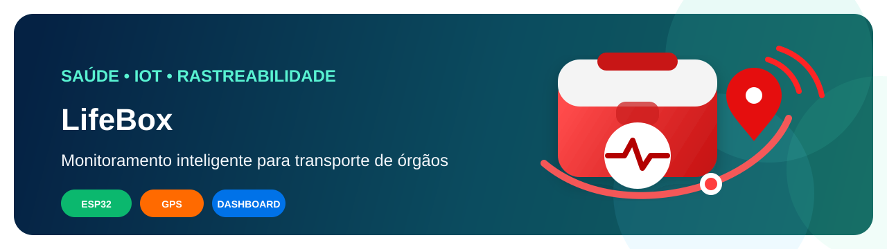
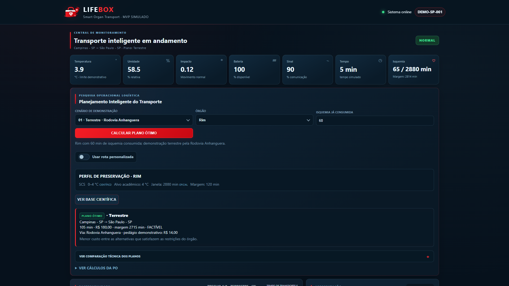

<p align="center">
  
</p>

# LifeBox — Smart Organ Transport

[](https://github.com/sandrozdb/lifebox-smart-organ-transport/actions/workflows/ci.yml)
[](LICENSE)
[](package.json)

LifeBox é um sistema acadêmico de apoio à decisão e rastreabilidade para transporte de órgãos. O diferencial é integrar planejamento multimodal sob restrições, execução rastreável, reotimização confirmada pelo operador, monitoramento simulado, Física e Eletrônica em uma única demonstração verificável.

## Stack e status

| Área            | Tecnologia / estado                                                       |
| --------------- | ------------------------------------------------------------------------- |
| Backend         | Node.js 20 / Express                                                      |
| Banco           | MySQL 8 local; repository em memória nos testes                           |
| Frontend e mapa | HTML, CSS, JavaScript, Leaflet / OpenStreetMap                            |
| Testes          | `node:test`, coverage e Playwright E2E                                    |
| Arquitetura     | C4 Context/Container, Strategy, Observer e SOLID documentado honestamente |
| CI              | GitHub Actions                                                            |
| Cloud           | **PENDENTE**: backend público, MySQL gerenciado e CD                      |

**Links rápidos:** [Arquitetura](docs/architecture.md) · [Pesquisa Operacional](docs/operations-research.md) · [API](docs/api.md) · [QA](docs/testing-and-qa.md) · [Validação pré-cloud](docs/pre-cloud-validation.md) · [Demo](docs/demo-guide.md) · [Evidências](docs/evidencias/README.md) · [Requisitos](docs/academic-requirements.md) · [Eletrônica](docs/electronics.md) · [Física](docs/physics.md)

## Aviso acadêmico

Este é um projeto acadêmico e demonstrativo. A LifeBox não é um dispositivo médico certificado, não substitui protocolos clínicos, não constitui recomendação médica e não confirma a preservação de órgãos. Os parâmetros de preservação apresentados são referências acadêmicas e devem ser interpretados somente dentro desse contexto.

## Funcionalidades

- dashboard com telemetria, mapa, alertas, timeline e resumo por execução;
- perfis de preservação por órgão, faixa térmica de referência, isquemia e margem;
- planos terrestres, helicóptero e multimodais com avião; avião não é solução direta hospital→hospital;
- plano congelado durante a execução e reotimização aplicada somente após confirmação;
- Física didática da execução atual: ΔT, taxa, Q, aceleração, potência, energia e autonomia;
- lógica digital `ATIVO AND (TEMP_CRÍTICA OR IMPACTO_CRÍTICO)` com LED/buzzer virtuais e circuito Logisim;
- API Express, MySQL local, repositório em memória para testes e CI.

## Arquitetura

```text
Simulador / futuro ESP32 → API Express → Serviços → Repository → MySQL
                                            ↓
                              Dashboard, mapa, alertas e timeline
```

A arquitetura real, C4 Context/Container, sequência da reotimização, Strategy, Observer, SOLID e trade-offs estão em [docs/architecture.md](docs/architecture.md).

## Disciplinas integradas

| Frente               | Implementação                               | Dashboard / documento         |
| -------------------- | ------------------------------------------- | ----------------------------- |
| Pesquisa Operacional | plano multimodal, restrições e reotimização | planejamento e mapa           |
| Física               | cálculos didáticos da execução atual        | Análise Física expansível     |
| Eletrônica           | `digitalAlertLogic` + Logisim               | atuadores e sinais lógicos    |
| Arquitetura          | C4, Strategy, Observer, SOLID               | painel técnico e documentação |
| QA                   | check, lint, testes, coverage, E2E e CI     | documentação de QA            |
| Cloud                | estrutura cloud-ready                       | status real: local/pendente   |

Veja [requisitos acadêmicos](docs/academic-requirements.md).

## Execução local

Pré-requisitos: Node.js 20+ e MySQL 8 local.

```powershell
npm install
Copy-Item .env.example .env
npm run setup-db
npm start
```

Abra [http://localhost:3000](http://localhost:3000). O `.env` permanece local e não deve conter credenciais em documentação ou commits.

## Testes

```powershell
npm run check
npm run lint
npm run format:check
npm test
npm run coverage
npm run e2e
```

A estratégia, o checklist E2E manual e o caso de bug de interface estão em [docs/testing-and-qa.md](docs/testing-and-qa.md). O CI executa as mesmas validações em push e pull request.

## Infraestrutura e limites

O backend e o schema são preparados para configuração por ambiente, Docker, MySQL remoto e health check. Não há backend público, banco gerenciado, CD real ou URL HTTPS publicada: esses itens estão pendentes e documentados em [docs/cloud.md](docs/cloud.md).

## Evidências

- [Catálogo das 20 evidências reais](docs/evidencias/README.md)
- [Galeria do dashboard](docs/evidencias/dashboard/README.md)
- [Eletrônica digital e Logisim](docs/electronics-evidence.md)
- [Circuito Logisim](electronics/lifebox-alert-logic.circ)



## Estrutura

```text
public/      dashboard HTML, CSS e JavaScript
src/         API, serviços, regras e persistência
simulator/   telemetria e cenários simulados
database/    schema MySQL
electronics/ circuito Logisim
docs/        documentação técnica e evidências
tests/       testes automatizados
```

## Próximas etapas pendentes

- escolha de cloud, backend público HTTPS e MySQL gerenciado;
- CD real, backup e observabilidade;
- integração futura de ESP32/sensores, mantendo o contrato de telemetria.

## Licença

Este projeto está licenciado sob a MIT License. Consulte o arquivo [LICENSE](LICENSE) para mais detalhes.
