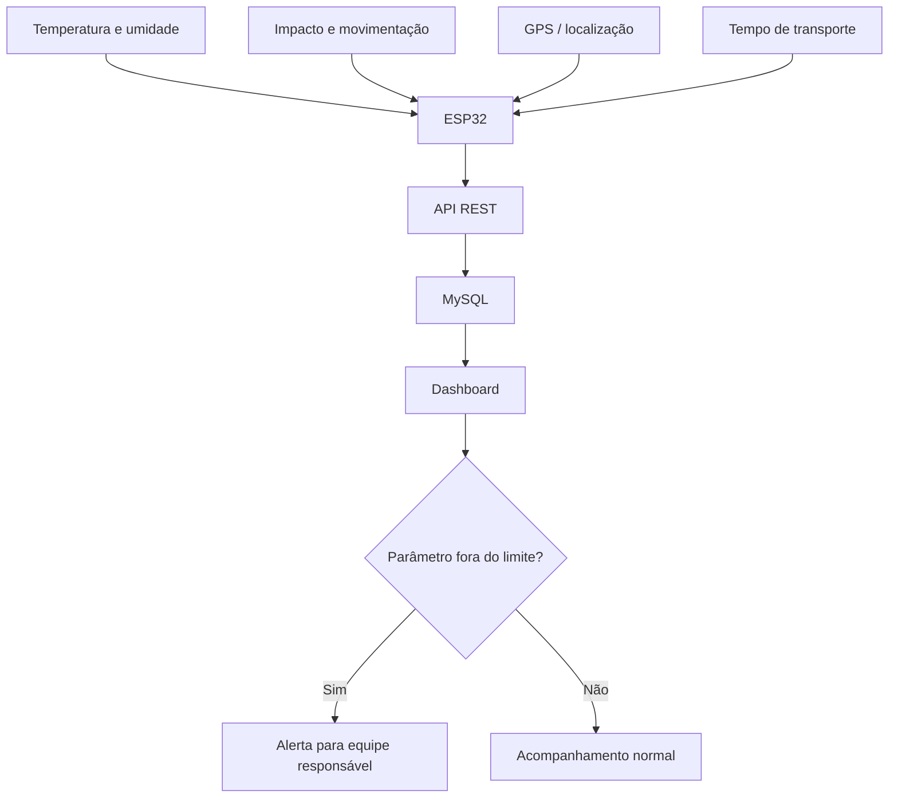

<p align="center"></p>

# LifeBox — Transporte Inteligente de Órgãos

Solução acadêmica de IoT para monitorar as condições de uma caixa térmica durante o transporte de órgãos, reunindo sensores, rastreabilidade e acompanhamento remoto em um único fluxo.

## Problema

O transporte de órgãos exige controle rigoroso das condições ao longo do trajeto. Alterações de temperatura, impactos, atrasos ou perda de rastreabilidade podem aumentar o risco operacional e dificultar a tomada de decisão pelas equipes responsáveis.

## Solução

A LifeBox propõe uma caixa térmica inteligente equipada com sensores e conectividade para acompanhar temperatura, umidade, movimentação, localização e tempo de transporte. Os dados são enviados para uma aplicação de monitoramento, permitindo histórico, indicadores e alertas quando algum parâmetro sair dos limites definidos.



## Monitoramento previsto

| Dado | Objetivo |
|---|---|
| Temperatura | Identificar variações térmicas durante o trajeto |
| Umidade | Acompanhar as condições internas da caixa |
| Impactos e movimentação | Registrar quedas ou movimentos bruscos |
| Localização | Permitir rastreabilidade do transporte |
| Tempo de transporte | Acompanhar a duração e possíveis atrasos |

## Arquitetura planejada

`Sensores → ESP32 → API REST → MySQL → Dashboard → Alertas`

A implementação será incremental. O software poderá ser validado inicialmente com dados simulados antes da integração completa com os componentes físicos.

## Tecnologias planejadas

### Hardware
- ESP32
- DHT22 ou sensor equivalente de temperatura e umidade
- MPU6050 para aceleração, inclinação e movimentação
- GPS NEO-6M para latitude e longitude
- Wi-Fi para conectividade no MVP

### Software
- Node.js
- Express
- MySQL
- HTML
- CSS
- JavaScript
- API REST

## Diferenciais

- aplicação de IoT em um processo crítico da área da saúde;
- monitoramento de múltiplas condições em uma única solução;
- histórico das leituras para rastreabilidade;
- arquitetura separando sensores, API, banco e visualização;
- possibilidade de alertas baseados em parâmetros definidos;
- evolução futura para conectividade móvel e acompanhamento em trânsito.

## Indicadores para um piloto

| Indicador | Decisão apoiada |
|---|---|
| Leituras fora dos limites | Identificar ocorrências críticas |
| Tempo total de transporte | Acompanhar duração do trajeto |
| Quantidade de impactos registrados | Avaliar condições de manuseio |
| Intervalo entre atualizações | Verificar regularidade do monitoramento |
| Disponibilidade do sistema | Medir continuidade do acompanhamento |

> Os indicadores estão definidos como parte do projeto, mas resultados numéricos só serão apresentados após testes e coleta de dados.

## Estrutura atual

```text
├── assets/
│   ├── cover.svg
│   └── lifebox-logo.jpg
├── docs/
│   ├── architecture.md
│   ├── database.md
│   └── hardware.md
├── .gitignore
└── README.md
```

## Status do projeto

🚧 **Em desenvolvimento**

O projeto está na fase inicial de definição da arquitetura e do MVP. As próximas implementações serão adicionadas ao repositório conforme o avanço do trabalho acadêmico.

## Próximos passos

- definir os limites e regras de alerta do protótipo;
- criar a API REST;
- modelar e implementar o banco MySQL;
- desenvolver um simulador de leituras;
- construir o dashboard de monitoramento;
- integrar ESP32 e sensores;
- validar o GPS em ambiente externo;
- registrar testes e evidências visuais do protótipo.

## Documentação

- [Arquitetura](docs/architecture.md)
- [Hardware planejado](docs/hardware.md)
- [Modelo inicial de dados](docs/database.md)

## Autor

**Sandro Ferreira** — estudante de Engenharia da Computação e de Inteligência Artificial e Automação Digital.

[LinkedIn](https://linkedin.com/in/sandrozdb) · [GitHub](https://github.com/sandrozdb)
