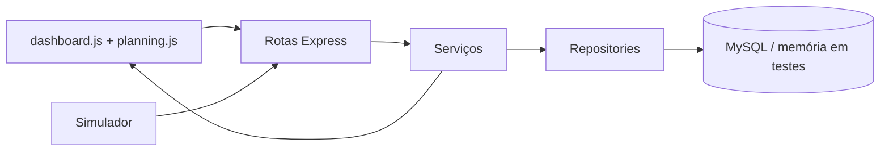

# Arquitetura da LifeBox

## Componentes reais

- **Frontend:** `public/js/dashboard.js` monitora telemetria, mapa, alertas, atuadores, Física e resumo; `planning.js` calcula e apresenta planos.
- **API:** rotas Express de simulação, telemetria, transporte, planejamento, física e otimização.
- **Serviços:** `organPlanningService`, `modalPlannerStrategies`, `groundRoutingProvider`, `executionPlanService`, `simulationService`, `physicsService`, `digitalAlertLogic`, `transportService` e `telemetryService`.
- **Eventos:** `AlertNotifier` e `TimelineAlertObserver`.
- **Persistência:** `mysqlRepository` na execução local e `memoryRepository` nos testes.

## Plano e execução

A PO constrói um plano composto por segmentos. Podem existir plano terrestre, helicóptero ou plano multimodal, como `TERRESTRE → AVIÃO → TERRESTRE` e `HELICÓPTERO → AVIÃO → TERRESTRE`. Um plano aéreo nunca é apresentado como avião direto entre hospitais.

Ao iniciar, `executionPlanService` congela o plano. A progressão, posição, distância, tempo simulado e isquemia vêm dos segmentos. Reotimização gera uma recomendação; o operador precisa confirmar a aplicação. A substituição mantém posição, histórico, tempo e isquemia.

## Padrões GoF

### Strategy

`modalPlannerStrategies` encapsula estratégias terrestre, helicóptero e aéreo multimodal. `groundRoutingProvider` fornece alternativas terrestres. Novas estratégias podem ser incluídas sem alterar a orquestração principal.

### Observer

`AlertNotifier` notifica `TimelineAlertObserver` quando uma ocorrência é criada. O observador registra o evento para que o dashboard exiba a timeline.

## SOLID aplicado

- **SRP:** `physicsService`, `executionPlanService`, `groundRoutingProvider` e `digitalAlertLogic` têm responsabilidades específicas.
- **OCP:** estratégias logísticas podem ser adicionadas como novas implementações sem reescrever o fluxo de planejamento.
- **DIP:** o repositório de memória permite que os testes não dependam do MySQL; não há uma abstração de injeção de dependência completa além desse limite.

O dashboard possui um painel técnico expansível com o resumo `Frontend → API → Serviços → Repository → MySQL`; os diagramas detalhados permanecem na documentação.
