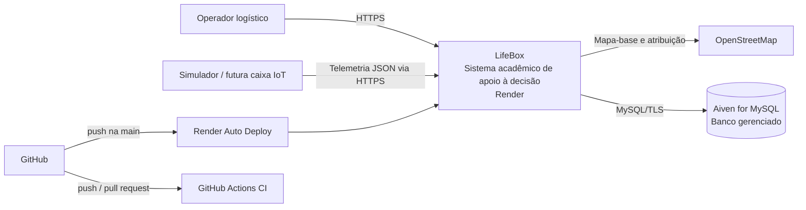
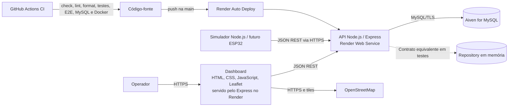
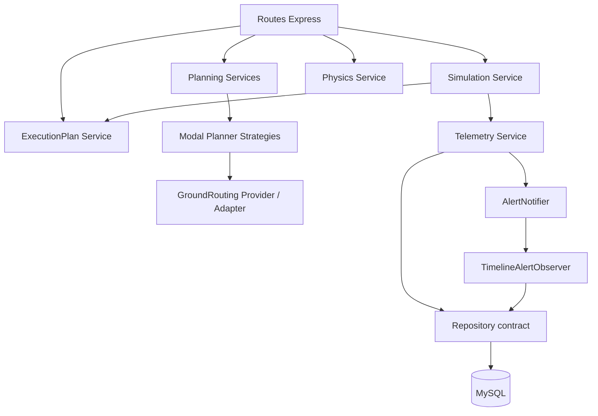
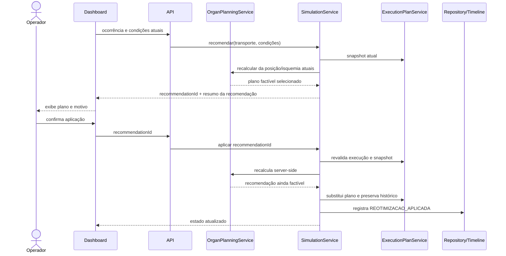

# Arquitetura da LifeBox

Esta documentação descreve a implementação atual, incluindo o deploy público concluído no Render e o banco gerenciado no Aiven.

## C4 Level 1 — System Context

O operador consulta planejamento, acompanha a execução e confirma uma reotimização. O simulador representa a futura caixa IoT; não há hardware clínico conectado. OpenStreetMap fornece tiles, enquanto rotas, custos, tempos e riscos do MVP são acadêmicos/simulados.

O deploy oficial está em `https://lifebox-expotech.onrender.com`. A persistência de produção usa Aiven for MySQL com TLS e certificado CA.

## C4 Level 2 — Container

| Container / serviço   | Responsabilidade                                                      |
| --------------------- | --------------------------------------------------------------------- |
| Dashboard             | Planejamento, mapa, telemetria, alertas, Física, Eletrônica e resumo. |
| API Express no Render | Validação HTTP, coordenação dos casos de uso e respostas JSON.        |
| Simulador             | Gera cenários e telemetria acadêmica.                                 |
| Aiven for MySQL       | Estado durável de transportes, leituras, alertas, timeline e resumos. |
| Repository em memória | Testes rápidos e determinísticos; não é banco de produção.            |
| GitHub Actions        | Integração contínua e validações automatizadas.                       |
| Render Auto Deploy    | Entrega contínua da branch `main` no serviço público.                 |

## Componentes do backend

O diagrama agrupa responsabilidades; não representa um componente para cada arquivo.

## Sequência da reotimização

O navegador não é autoridade sobre custo, segmentos, geometria ou modal. A recomendação possui ID, vínculo com transporte/execução, validade curta, proteção contra replay e recálculo antes da aplicação.

## Camadas e fronteiras

- **Routes:** adaptam HTTP, validam IDs/payloads e delegam casos de uso.
- **Services:** regras de planejamento, simulação, execução, Física e telemetria.
- **Observers:** propagam efeitos secundários de alertas sem acoplar a regra à timeline.
- **Repositories:** contrato implícito comum às implementações MySQL e memória.
- **Config:** perfis de órgãos e premissas acadêmicas centralizadas.

O simulador independente usa a API. O modo de demonstração embutido também pode coordenar serviços dentro do processo para manter uma execução simples; essa é uma escolha de MVP, não um microserviço.

## Strategy

O Context é [`organPlanningService.calculate`](../src/services/organPlanningService.js). As strategies em [`modalPlannerStrategies.js`](../src/services/modalPlannerStrategies.js) são:

- `GroundTransportStrategy`;
- `HelicopterTransportStrategy`;
- `MultimodalAirTransportStrategy`.

Contrato implícito: `plan({ origin, destination, locationProvider, conditions })` retorna uma alternativa ou lista de alternativas com `id`, `name`, `modal`, `modalCode`, `segments` e `requiredInfrastructure`. Testes contratuais verificam a forma comum. [`groundRoutingProvider.js`](../src/services/groundRoutingProvider.js) é um provider/adapter de roteamento terrestre, não a Strategy principal.

## Observer

[`AlertNotifier`](../src/observers/alertNotifier.js) é Publisher/Subject; [`TimelineAlertObserver`](../src/observers/timelineAlertObserver.js) é Subscriber/Observer. `subscribe` registra o observador e `notify` publica uma ocorrência. Existe um único observer porque ele atende um efeito real; observers artificiais não foram adicionados.

## SOLID — avaliação honesta

- **SRP — parcial/forte:** Física, lógica digital, execução e providers são coesos; `simulationService` ainda é um orquestrador amplo por escolha de MVP.
- **OCP — forte no planejamento:** modalities e observers podem ser estendidos sem reescrever seus consumidores.
- **LSP — demonstrado no limite das Strategies:** todas atendem o mesmo contrato comportamental.
- **ISP — não formalizado:** JavaScript/CommonJS usa contratos pequenos e implícitos; interfaces fictícias não foram criadas.
- **DIP — parcial:** memória/MySQL são substituíveis e providers podem ser fornecidos ao planejamento, mas a composição principal ainda seleciona implementações concretas na inicialização.

## Trade-offs e limitações

- `execution plan` e `recommendationId` ativos ficam em memória do processo e podem ser perdidos em reinício; dados persistidos no MySQL permanecem no Aiven;
- o MVP usa uma única instância gratuita do Render e pode sofrer cold start após inatividade;
- o Auto Deploy está configurado em `On Commit`: CI e CD partem do mesmo push, mas o deploy não espera obrigatoriamente a conclusão da CI;
- rotas, custos, tempos, risco e disponibilidade são acadêmicos/simulados;
- o serviço é uma demonstração acadêmica pública sem autenticação completa; não deve receber dados clínicos, pessoais ou operacionais sensíveis;
- restrição de rede do banco, usuário de menor privilégio, rotação de credenciais, backup avançado e observabilidade são melhorias de hardening futuras.
