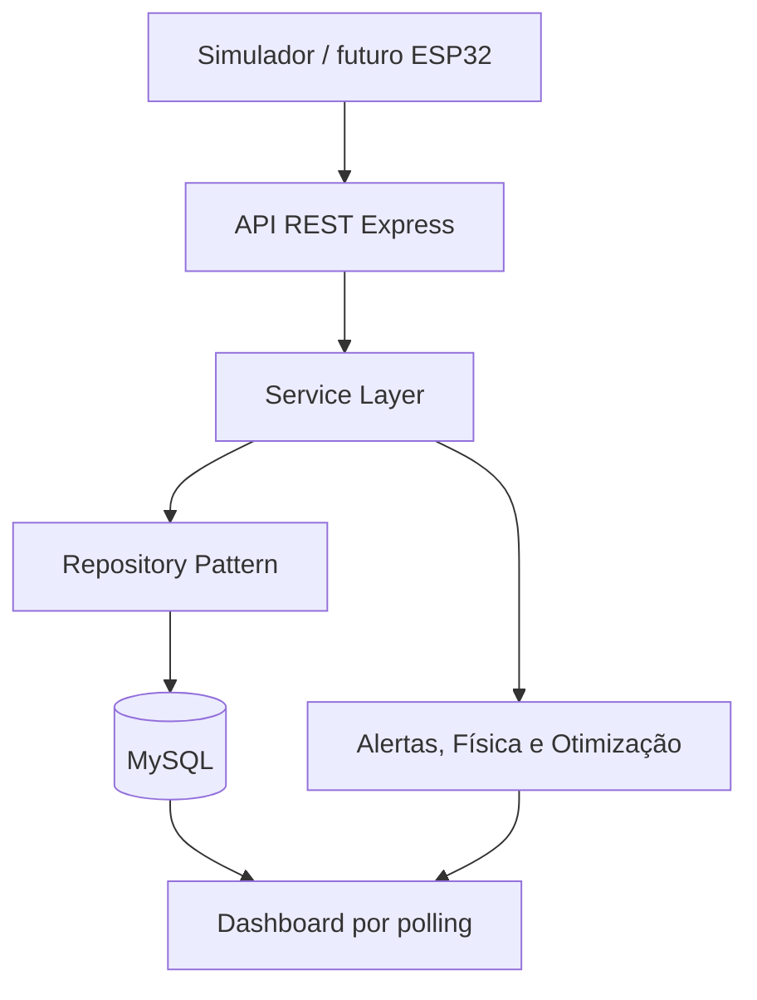
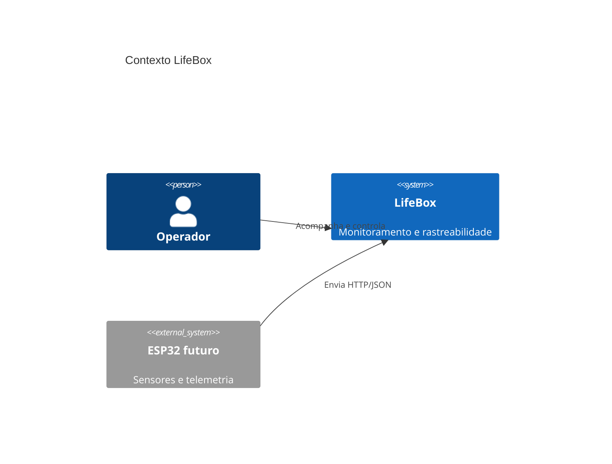
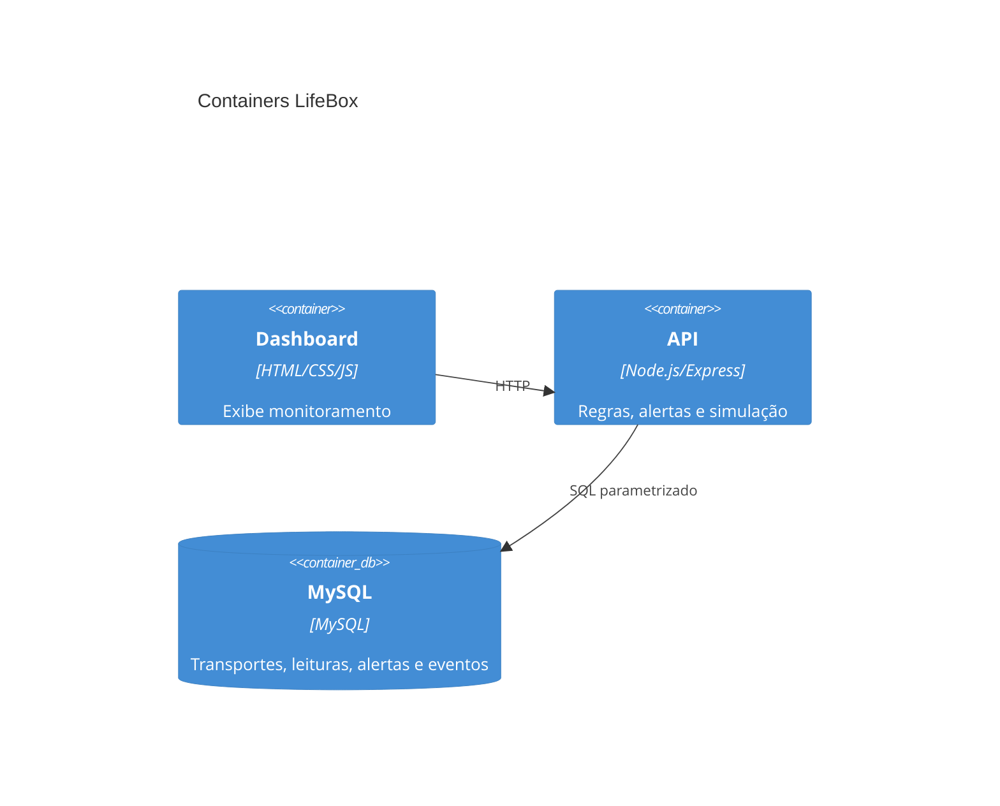

# Arquitetura da LifeBox

## Visão geral

A arquitetura da LifeBox foi pensada para separar a coleta dos dados físicos, o processamento, o armazenamento e a visualização das informações.

```text
Sensores
  ↓
ESP32
  ↓
API REST
  ↓
MySQL
  ↓
Dashboard Web
  ↓
Alertas e acompanhamento remoto
```

## Componentes

### Camada física
Responsável pela coleta de temperatura, umidade, impactos e localização.

### Microcontrolador
O ESP32 recebe as leituras dos sensores e prepara os dados para envio.

### API
Responsável por receber as leituras, validar os dados e disponibilizá-los para o sistema.

### Banco de dados
O MySQL armazena o histórico das medições e eventos de transporte.

### Dashboard
Interface web para acompanhamento das condições da LifeBox e consulta do histórico.

## Evolução prevista

O projeto será implementado de forma incremental. O primeiro MVP poderá utilizar dados simulados para validar API, banco e dashboard antes da integração completa com o hardware físico.

---

## Estado atual do MVP

# Arquitetura



```text
Sensores simulados / futuro ESP32
             ↓ JSON HTTP
API REST Express → validação → serviço de telemetria
             ↓                 ↓
          MySQL          motor de regras
             ↓                 ↓
 leituras, eventos e alertas → dashboard (polling a cada 2 s)
```

## Decisões

- Polling foi escolhido por simplicidade, previsibilidade local e facilidade de explicação.
- Repositórios isolam o MySQL; testes usam memória e não exigem senha no CI.
- O simulador usa o mesmo contrato HTTP que o futuro ESP32.
- Limites ficam centralizados em `src/config/thresholds.js`.
- Leaflet/OpenStreetMap enriquece o mapa quando há internet; telemetria e coordenadas continuam funcionando offline.

## Padrões realmente utilizados

- **Repository Pattern:** `src/repositories/` troca MySQL por memória sem alterar serviços.
- **Service Layer:** telemetria, transporte, otimização, Física e simulação concentram regras fora das rotas HTTP.
- **Strategy:** as rotas candidatas são estratégias alternativas avaliadas pelo mesmo modelo; cenários alteram a estratégia de geração dos sensores.
- **Atualização observável:** o dashboard observa mudanças por polling. Não é um event bus completo, por isso não é descrito como arquitetura event-driven.

O módulo de Pesquisa Operacional seleciona a rota; o serviço de simulação usa seu identificador; o gerador de localização percorre seus pontos; telemetria, Física, persistência e dashboard permanecem desacoplados da escolha.

## GoF e SOLID

### Strategy (GoF)

`src/services/weightedRouteScoringStrategy.js` é a estratégia de cálculo da função objetivo ponderada. `routeOptimizationService.js` depende da interface `calculate(normalized, weights)`, permitindo trocar o algoritmo de score sem alterar a seleção, restrições ou persistência.

### Observer (GoF)

`src/observers/alertNotifier.js` é o Subject e mantém observadores inscritos. `src/observers/timelineAlertObserver.js` é um Observer: ao receber `alertCreated`, registra o evento de rastreabilidade. `telemetryService.js` cria o alerta e apenas notifica o Subject, sem conhecer a implementação da timeline.

Repository Pattern e Service Layer são separações arquiteturais úteis, mas não são classificados aqui como GoF.

Princípios SOLID aplicados: responsabilidade única (pontuação, lógica digital e timeline em módulos próprios); aberto/fechado (nova estratégia ou observador pode ser acrescentado sem alterar o fluxo de telemetria); inversão de dependência prática (o serviço usa o contrato de estratégia e o Subject usa o contrato `update`).

## C4 simplificado



