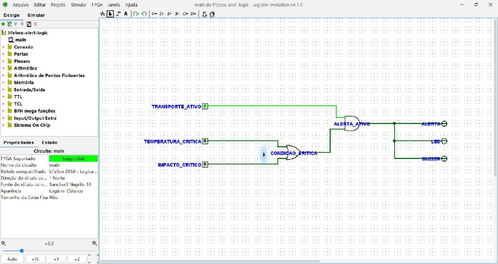
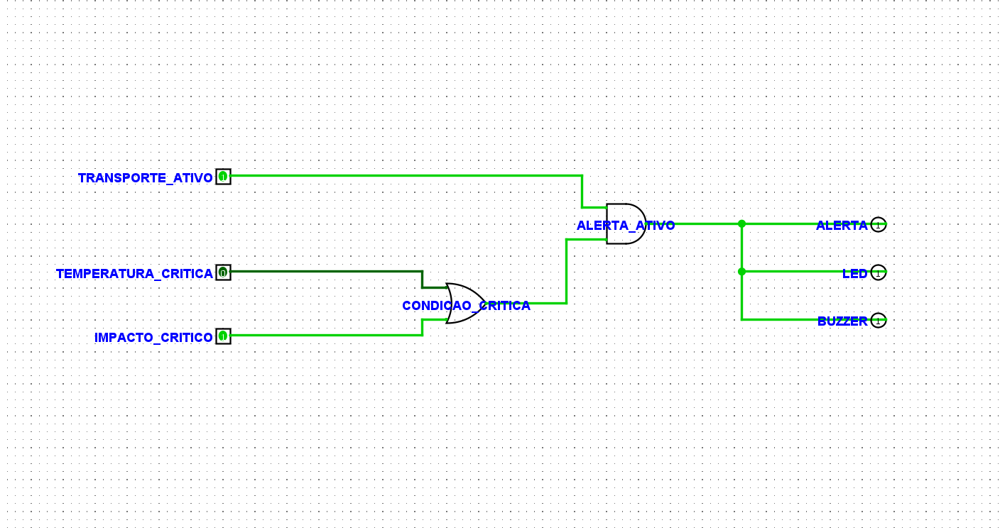
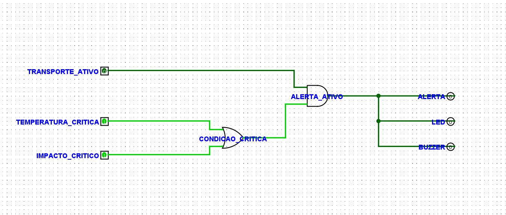

# Evidências — Eletrônica Digital

A lógica combinacional validada no Logisim Evolution 4.1.0 e implementada no software é:

```text
ALERTA = TRANSPORTE_ATIVO AND (TEMPERATURA_CRITICA OR IMPACTO_CRITICO)
```

O fluxo no MVP é: **sensor/simulação → software → comparação com o perfil do órgão → sinal booleano `TEMPERATURA_CRITICA` → lógica digital → LED/buzzer**. O circuito recebe apenas sinais `0` ou `1`; a comparação da temperatura é responsabilidade do software.

- Alertas **digitais**: temperatura crítica e impacto crítico; acionam LED e buzzer.
- Alertas **operacionais**: umidade, bateria, sinal, atraso e reotimização; são registrados e exibidos, mas não entram na equação digital.

A porta **OR** representa a condição crítica de temperatura ou impacto. A porta **AND** bloqueia a saída quando o transporte não está ativo. A mesma regra está em [`src/services/digitalAlertLogic.js`](../src/services/digitalAlertLogic.js); o circuito é [`electronics/lifebox-alert-logic.circ`](../electronics/lifebox-alert-logic.circ).

## Tabela verdade

| TRANSPORTE_ATIVO | TEMPERATURA_CRITICA | IMPACTO_CRITICO | ALERTA / LED / BUZZER |
|---:|---:|---:|---:|
| 0 | 0 | 0 | 0 |
| 0 | 0 | 1 | 0 |
| 0 | 1 | 0 | 0 |
| 0 | 1 | 1 | 0 |
| 1 | 0 | 0 | 0 |
| 1 | 0 | 1 | 1 |
| 1 | 1 | 0 | 1 |
| 1 | 1 | 1 | 1 |

## 1. Estado normal

Transporte inativo e nenhuma condição crítica. ALERTA, LED e BUZZER permanecem desligados.



## 2. Temperatura crítica

Transporte ativo e temperatura fora da faixa de referência do órgão selecionado: ALERTA, LED e BUZZER são ativados.


## 3. Impacto crítico

Transporte ativo e impacto crítico: ALERTA, LED e BUZZER são ativados.



## 4. Transporte inativo

Mesmo com entradas críticas, a saída permanece em `0` quando `TRANSPORTE_ATIVO = 0`.



## Evidências concluídas

- [x] Circuito compatível com Logisim Evolution 4.1.0.
- [x] Lógica sem valores de erro (`E`).
- [x] Estado normal demonstrado.
- [x] Temperatura crítica acionando LED e buzzer.
- [x] Impacto crítico acionando LED e buzzer.
- [x] Transporte inativo bloqueando o alerta.
- [x] Tabela verdade completa conferida.
- [x] Comparação realizada com `src/services/digitalAlertLogic.js`.
