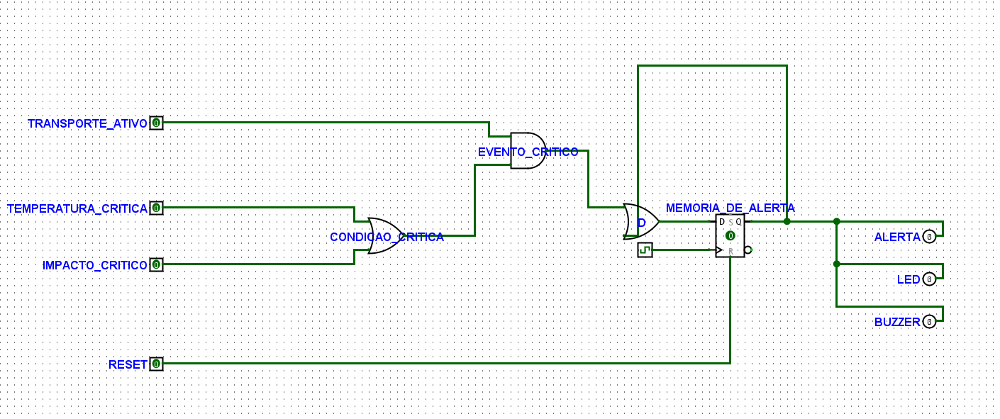
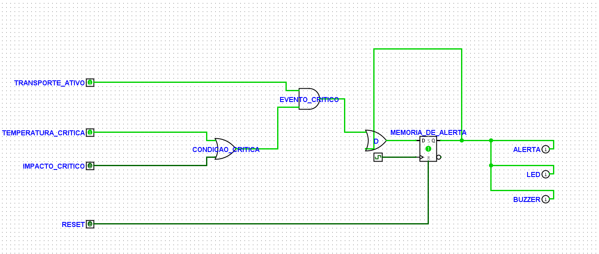
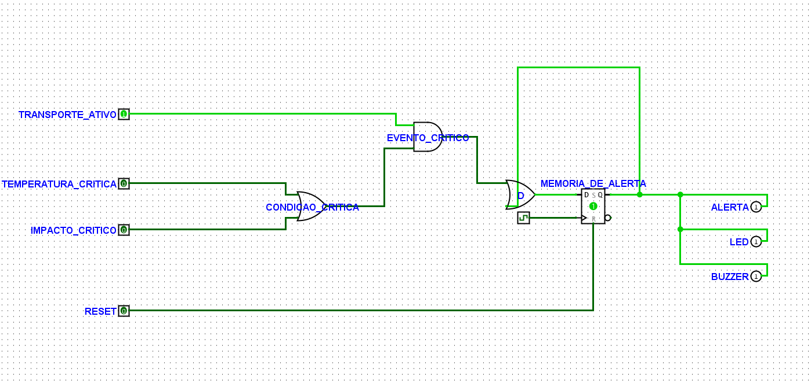
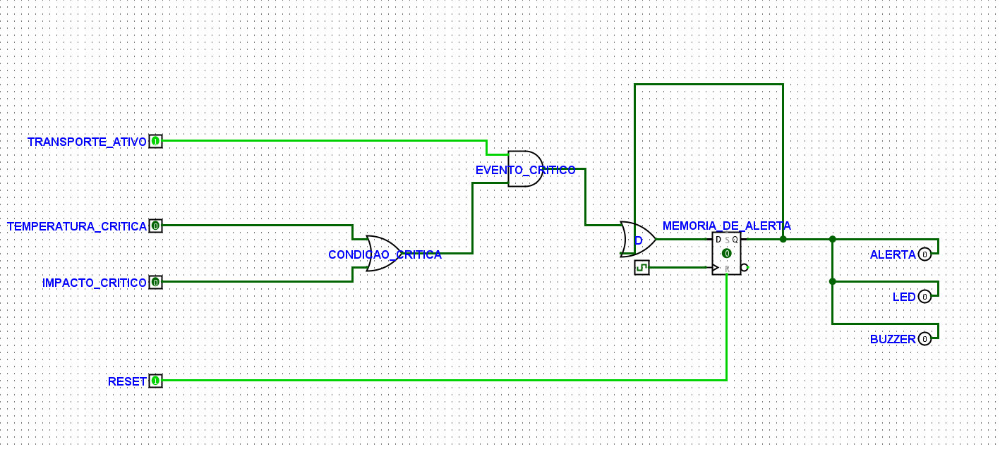

# Evidências — Eletrônica Digital

O circuito [`electronics/lifebox-alert-logic.circ`](../electronics/lifebox-alert-logic.circ) foi validado manualmente no Logisim Evolution 4.1.0 como uma extensão sequencial acadêmica da detecção de eventos críticos.

## Escopo e distinção entre software e Logisim

O backend e o Wokwi continuam usando a regra **combinacional** atual:

```text
CONDICAO_CRITICA = TEMPERATURA_CRITICA OR IMPACTO_CRITICO
EVENTO_CRITICO = TRANSPORTE_ATIVO AND CONDICAO_CRITICA
```

Nesse fluxo, LED e buzzer acompanham a condição crítica atual e desligam quando ela normaliza. O backend não implementa Flip-Flop.

No Logisim, a mesma detecção é encaminhada para uma memória D Flip-Flop:

```text
D = Q OR EVENTO_CRITICO

Com RESET = 1:
Q = 0 imediatamente

Na borda de subida do CLOCK, com RESET = 0:
Q(n+1) = D

ALERTA = Q
LED = Q
BUZZER = Q
```

Assim, `Q` mantém o alerta após a normalização até que `RESET` seja acionado.

## A. Tabela combinacional — geração de `EVENTO_CRITICO`

| TRANSPORTE_ATIVO | TEMPERATURA_CRITICA | IMPACTO_CRITICO | CONDICAO_CRITICA | EVENTO_CRITICO |
| ---------------: | ------------------: | --------------: | ---------------: | -------------: |
|                0 |                   0 |               0 |                0 |              0 |
|                0 |                   0 |               1 |                1 |              0 |
|                0 |                   1 |               0 |                1 |              0 |
|                0 |                   1 |               1 |                1 |              0 |
|                1 |                   0 |               0 |                0 |              0 |
|                1 |                   0 |               1 |                1 |              1 |
|                1 |                   1 |               0 |                1 |              1 |
|                1 |                   1 |               1 |                1 |              1 |

## B. Tabela de estados — D Flip-Flop

| RESET | Q atual | EVENTO_CRITICO | CLOCK | Q próximo |
| ----: | ------: | -------------: | :---: | --------: |
|     1 |       X |              X |   X   |         0 |
|     0 |       0 |              0 |   ↑   |         0 |
|     0 |       0 |              1 |   ↑   |         1 |
|     0 |       1 |              0 |   ↑   |         1 |
|     0 |       1 |              1 |   ↑   |         1 |

`X` significa valor irrelevante; `↑` é a borda de subida do clock. `RESET` é assíncrono, portanto limpa `Q` sem aguardar uma borda.

## 1. Estado normal

Com `Q = 0` e sem evento crítico, ALERTA, LED e BUZZER permanecem desligados.



## 2. Evento crítico memorizado

Temperatura crítica com transporte ativo gera `EVENTO_CRITICO = 1`. Na borda de subida seguinte do CLOCK, o D Flip-Flop armazena `Q = 1` e ativa ALERTA, LED e BUZZER.



## 3. Alerta mantido após normalização

Após a temperatura retornar ao normal, `EVENTO_CRITICO` volta a `0`, mas a realimentação `D = Q OR EVENTO_CRITICO` mantém `Q = 1`. ALERTA, LED e BUZZER continuam ativos.



## 4. Reset assíncrono

Com `RESET = 1`, o D Flip-Flop limpa `Q` imediatamente, sem novo CLOCK, e desliga ALERTA, LED e BUZZER.



## Validação manual concluída

- [x] Estado inicial com `Q = 0`.
- [x] Temperatura crítica com transporte ativo gerando `EVENTO_CRITICO = 1`.
- [x] Borda de subida do CLOCK armazenando `Q = 1`.
- [x] Normalização de temperatura sem limpar `Q`.
- [x] ALERTA, LED e BUZZER permanecendo em `1` enquanto `Q = 1`.
- [x] `RESET = 1` limpando `Q` imediatamente, sem novo CLOCK.
- [x] Circuito validado manualmente no Logisim Evolution 4.1.0.
- [x] Comparação documentada com `src/services/digitalAlertLogic.js`, sem atribuir o Flip-Flop ao backend/Wokwi.
