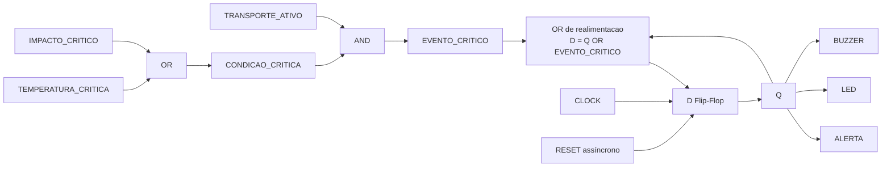

# Eletrônica Digital e Analógica

## Estado atual

O circuito clínico físico ainda não foi construído, mas o **protótipo eletrônico virtual foi implementado e validado no Wokwi Web** com ESP32, sensores, OLED, LED e buzzer.

Projeto: https://wokwi.com/projects/473749722940837889

```text
Grandeza física → sensor/módulo → ESP32 → JSON/HTTPS → API no Render
                                           ↑             ↓
                                      OLED/LED/Buzzer ← digitalSignal
```

| Componente    | Grandeza/função                   | Interface usada no protótipo |
| ------------- | --------------------------------- | ---------------------------- |
| DHT22         | Temperatura e umidade             | sinal digital no GPIO 14     |
| MPU6050       | Aceleração nos três eixos         | I2C, GPIO 21/22              |
| GPS NEO-6M    | Latitude, longitude e velocidade  | UART, RX2/TX2 GPIO 16/17     |
| ESP32         | Leitura, Wi-Fi e integração HTTPS | GPIO, ADC, I2C, UART e Wi-Fi |
| Potenciômetro | Bateria simulada                  | ADC GPIO 34                  |
| OLED SSD1306  | Estado local                      | I2C, endereço `0x3C`         |
| LED           | Alerta visual                     | GPIO 25                      |
| Buzzer        | Alerta sonoro                     | GPIO 26                      |

Entradas digitais representam estados discretos ou protocolos; entradas analógicas convertem tensão contínua pelo ADC. I2C permite compartilhar o barramento entre MPU6050 e OLED, enquanto UART é usada pelo GPS customizado.

## Lógica digital de alerta e extensão sequencial

### Backend e Wokwi: lógica combinacional em produção acadêmica

A regra em uso pelo backend e pelo firmware Wokwi continua combinacional. Ela é calculada em `src/services/digitalAlertLogic.js` e retornada ao dispositivo como `digitalSignal`:

```text
CONDICAO_CRITICA = TEMPERATURA_CRITICA OR IMPACTO_CRITICO
EVENTO_CRITICO = TRANSPORTE_ATIVO AND CONDICAO_CRITICA
```

Enquanto a condição crítica atual existir, `EVENTO_CRITICO` ativa LED e buzzer. Quando temperatura e impacto normalizam, o sinal do backend/Wokwi volta a `0`. O backend **não implementa Flip-Flop**.

#### Tabela combinacional — geração de `EVENTO_CRITICO`

| TRANSPORTE_ATIVO | TEMPERATURA_CRITICA | IMPACTO_CRITICO | CONDICAO_CRITICA | EVENTO_CRITICO |
| ---------------: | ------------------: | --------------: | ---------------: | -------------: |
|                0 |                   0 |               0 |                0 |              0 |
|                0 |                   0 |               1 |                1 |              0 |
|                0 |                   1 |               0 |                1 |              0 |
|                0 |                   1 |               1 |                1 |              0 |
|                1 |                   0 |               0 |                0 |              0 |
|                1 |                   0 |               1 |                1 |              1 |
|                1 |                   1 |               0 |                1 |              1 |
|                1 |                   1 |               1 |                1 |              1 |

### Logisim: extensão sequencial acadêmica

O circuito [`../electronics/lifebox-alert-logic.circ`](../electronics/lifebox-alert-logic.circ) mantém a mesma detecção combinacional e acrescenta memória acadêmica com um D Flip-Flop:

```text
D = Q OR EVENTO_CRITICO

Com RESET = 1:
Q = 0 imediatamente

Na borda de subida do CLOCK, com RESET = 0:
Q(n+1) = D

ALERTA = Q
LED = Q
BUZZER = Q
```

O Logisim captura um evento crítico na próxima borda de subida do `CLOCK`. Depois de `Q` se tornar `1`, o alerta permanece memorizado mesmo quando temperatura e impacto voltam ao normal. `RESET` é assíncrono: ao receber `1`, limpa `Q` imediatamente, sem exigir novo pulso de clock.

#### Tabela de estados — D Flip-Flop

| RESET | Q atual | EVENTO_CRITICO | CLOCK | Q próximo |
| ----: | ------: | -------------: | :---: | --------: |
|     1 |       X |              X |   X   |         0 |
|     0 |       0 |              0 |   ↑   |         0 |
|     0 |       0 |              1 |   ↑   |         1 |
|     0 |       1 |              0 |   ↑   |         1 |
|     0 |       1 |              1 |   ↑   |         1 |

`X` significa valor irrelevante e `↑` representa a borda de subida do `CLOCK`.



## Backend como fonte de verdade

No protótipo Wokwi, o ESP32 **não replica a regra digital**. O firmware envia a leitura e consulta `/api/iot/status`. O backend decide a criticidade atual e devolve `digitalSignal`.

O dispositivo aplica apenas:

- `digitalSignal.ledOn` no LED;
- `digitalSignal.buzzerOn` no buzzer;
- perfil/estado no OLED.

Isso evita divergência entre a regra mostrada no dashboard e uma regra paralela no firmware.

## DEMO x IOT

- **DEMO:** temperatura/impacto críticos podem ser forçados pelos cenários acadêmicos do dashboard;
- **IOT:** temperatura, impacto, umidade, bateria e sinal vêm dos sensores Wokwi e os botões de cenário da caixa ficam bloqueados;
- **ambos:** condições logísticas não acionam LED/buzzer por si só, pois são eventos operacionais e não sinais críticos da caixa.

## Logisim

O Logisim é uma **extensão sequencial acadêmica**, separada do comportamento combinacional vigente no backend/Wokwi. As quatro capturas validadas manualmente estão em [`electronics-evidence.md`](electronics-evidence.md).

## Limite físico

O Wokwi demonstra pinagem, protocolos, ADC, I2C, UART, lógica e integração com o software. Uma montagem física exigiria alimentação/regulação, proteção elétrica, dimensionamento de corrente, estágio adequado para atuadores, calibração e ensaios antes de qualquer uso real.

Mais detalhes: [`hardware.md`](hardware.md), [`iot.md`](iot.md) e [`../firmware/README.md`](../firmware/README.md).
