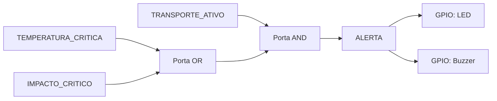

# Eletrônica Digital e Analógica

> Arquitetura planejada; nenhum circuito físico foi montado ou testado.

```text
Grandeza física → sensor/módulo → sinal → ESP32 → JSON/Wi-Fi → API
```

| Componente | Grandeza/função | Interface prevista |
|---|---|---|
| Sensor térmico/DHT22 | Temperatura e umidade | sinal digital temporizado; outro sensor pode usar ADC/I2C |
| MPU6050 | Aceleração nos três eixos | barramento digital I2C (SDA/SCL) |
| NEO-6M | Latitude, longitude e velocidade | comunicação serial UART (TX/RX) |
| ESP32 | Leitura, processamento e Wi-Fi | GPIO, ADC, I2C, UART e rádio digital |
| LED/buzzer opcional | alerta local | saída digital GPIO, com acionamento adequado |

Entradas digitais representam estados discretos ou protocolos; entradas analógicas convertem tensão contínua pelo ADC. I2C permite endereçar periféricos no mesmo barramento, enquanto UART é comunicação serial ponto a ponto. A alimentação deverá considerar tensão, corrente, autonomia, regulação, proteção e compatibilidade lógica.


## Lógica digital de alerta

A lógica combinacional demonstrativa é calculada em `src/services/digitalAlertLogic.js`:

```text
ALERTA = TRANSPORTE_ATIVO AND (TEMPERATURA_CRITICA OR IMPACTO_CRITICO)
```

Tabela verdade:

| Transporte ativo | Temperatura crítica | Impacto crítico | ALERTA / LED / buzzer |
|---:|---:|---:|---:|
| 0 | 0 | 0 | 0 |
| 0 | 0 | 1 | 0 |
| 0 | 1 | 0 | 0 |
| 0 | 1 | 1 | 0 |
| 1 | 0 | 0 | 0 |
| 1 | 0 | 1 | 1 |
| 1 | 1 | 0 | 1 |
| 1 | 1 | 1 | 1 |



No MVP, a saída é um sinal digital de software retornado junto da telemetria. No protótipo físico, o ESP32 poderá aplicar a saída `ALERTA` a um GPIO, usando estágio de acionamento apropriado para LED ou buzzer. A lógica não substitui proteção elétrica, corrente adequada, transistor/driver ou validação em hardware.