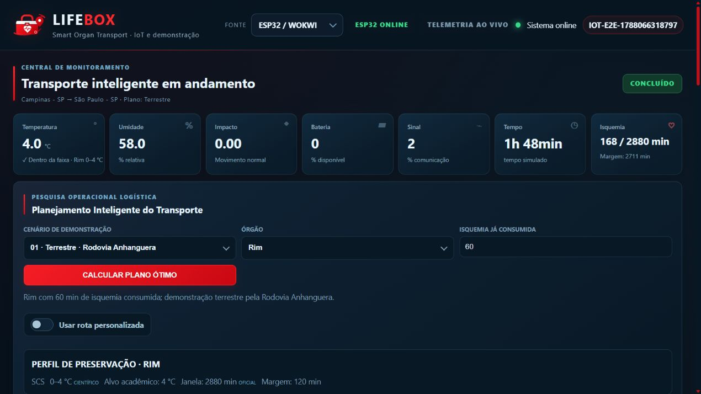
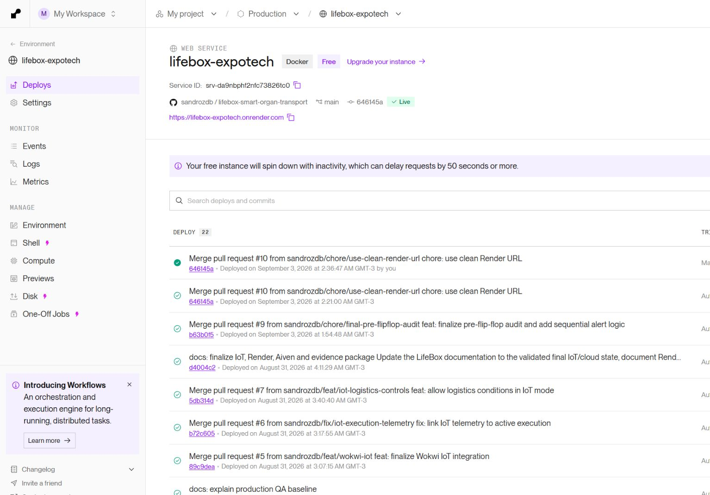
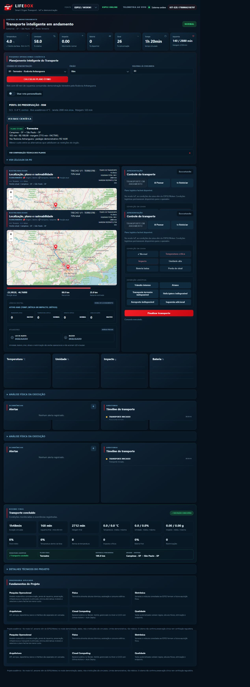
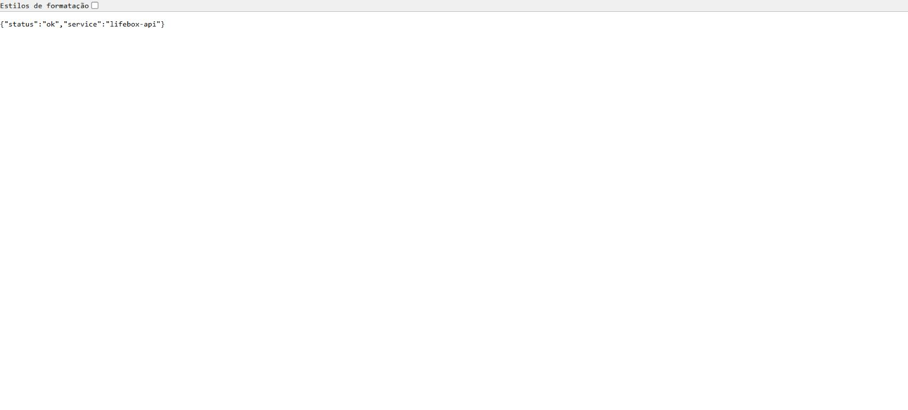
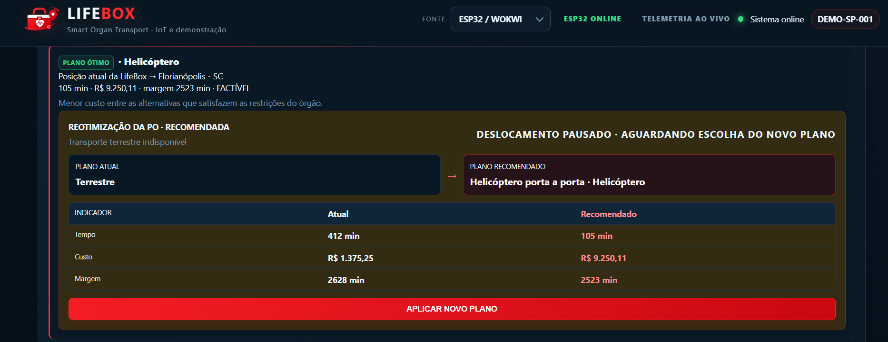
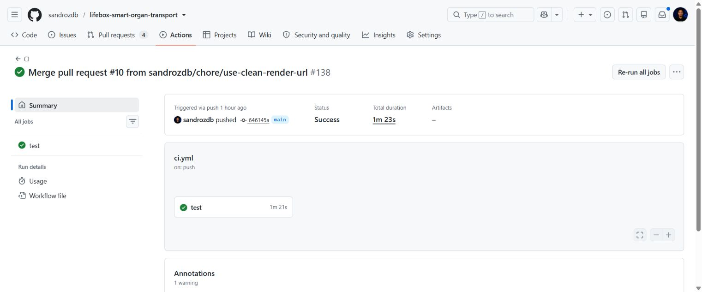
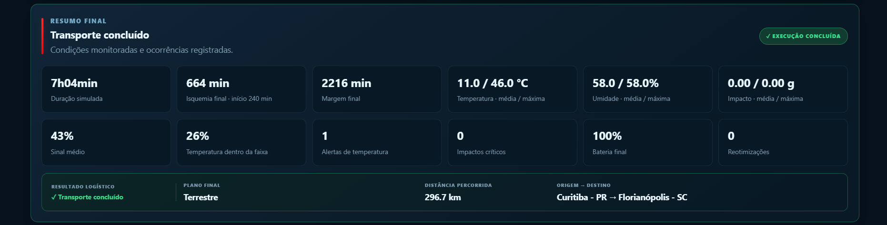

# Evidências visuais — LifeBox

Este diretório reúne duas camadas de evidência:

1. **baseline histórica pré-cloud**, com 20 capturas reais do dashboard feitas em 29/08/2026;
2. **pacote final IoT + Cloud**, com nove evidências IoT e oito evidências Cloud concluídas.

As imagens históricas continuam válidas para demonstrar PO, Física, Eletrônica, arquitetura, QA, rastreabilidade, alertas e reotimização. A captura antiga `20-cloud-status.png` representa propositalmente o estado anterior ao deploy e não deve ser usada como prova do ambiente atual.

## Pacote final

- [IoT / Wokwi](iot/README.md): ESP32, telemetria, gráficos, Física, logística, reotimização e resumo final.
- [Cloud](cloud/README.md): Render, Aiven, health check, CI e dashboard público.
- [Eletrônica / Flip-Flop](eletronica/README.md): circuito Logisim sequencial e evidências acadêmicas existentes.
- [Checklist geral](../evidence-checklist.md): estado de cada frente e pendências visuais restantes.

### Destaques

| IoT | Cloud |
| --- | --- |
|  |  |
|  |  |
|  |  |
|  | Cloud 8/8 |

## Ambiente atual

- Dashboard/Backend: `https://lifebox-expotech.onrender.com`
- Health check: `https://lifebox-expotech.onrender.com/api/health`
- Wokwi: `https://wokwi.com/projects/473749722940837889`
- Banco: Aiven for MySQL com TLS/CA
- `main`: `7d3ce046836ff2266701e48e6ec9666b7dba555a`
- CI: GitHub Actions `#147 SUCCESS`
- Pacotes finais: IoT `9/9`; Cloud `8/8`

## Baseline pré-cloud — 20 capturas

As imagens abaixo foram recapturadas da aplicação real local, preferencialmente em 1920×1080, zoom 100%, sem mockup e sem geração artificial de estados.

### 1. Operação e rastreabilidade

- [01 — Dashboard normal](dashboard/01-dashboard-normal.png)
- [04 — Transporte em andamento](dashboard/04-transporte-andamento.png)
- [13 — Isquemia e tempo](dashboard/13-isquemia-tempo.png)

### 2. Pesquisa Operacional

- [02 — Plano terrestre](dashboard/02-po-terrestre.png)
- [03 — Base científica](dashboard/03-base-cientifica.png)

### 3. Multimodalidade

- [05 — Plano aéreo multimodal](dashboard/05-plano-aereo-multimodal.png)
- [06 — Aeroportos no mapa](dashboard/06-aeroportos-mapa.png)
- [07 — Helicóptero + avião](dashboard/07-helicoptero-aviao.png)

### 4. Alertas e atuadores

- [08 — Temperatura crítica](dashboard/08-alerta-temperatura.png)
- [09 — Impacto crítico](dashboard/09-alerta-impacto.png)
- [10 — Atraso operacional](dashboard/10-alerta-atraso.png)

### 5. Reotimização

- [11 — Reotimização recomendada](dashboard/11-reotimizacao-recomendada.png)
- [12 — Reotimização aplicada](dashboard/12-reotimizacao-aplicada.png)

### 6. Física

- [14 — Análise física](dashboard/14-fisica.png)

### 7. Eletrônica e lógica digital

- [15 — Lógica digital](dashboard/15-logica-digital.png)
- [Circuito no Logisim](eletronica/README.md)

### 8. Arquitetura e QA

- [18 — Status de QA](dashboard/18-qa-status.png)
- [19 — Arquitetura do sistema](dashboard/19-arquitetura-status.png)

Essas capturas são históricas. A arquitetura e o QA atuais estão em [`../architecture.md`](../architecture.md) e [`../testing-and-qa.md`](../testing-and-qa.md).

### 9. Cloud histórica

- [20 — Status de infraestrutura pré-cloud](dashboard/20-cloud-status.png)

Essa imagem **não representa o estado atual**. Para a prova atual de Cloud, use a pasta [`cloud/`](cloud/README.md).

### 10. Resumos finais

- [16 — Execução normal](dashboard/16-resumo-final-normal.png)
- [17 — Execução com ocorrências](dashboard/17-resumo-final-ocorrencias.png)

## Estado final validado e documentado

- [x] ESP32/Wokwi conectado ao Render.
- [x] Telemetria IoT persistida no Aiven.
- [x] Leituras vinculadas à execução ativa pelo backend.
- [x] Gráficos IoT preenchidos.
- [x] Análise Física IoT funcionando.
- [x] Resumo final IoT com agregados da execução.
- [x] Condições Logísticas disponíveis no modo IOT.
- [x] Reotimização e mudança de rota funcionando em IOT.
- [x] Render público e health check funcionando.
- [x] Aiven for MySQL conectado via TLS.
- [x] CI/CD validados.
- [x] Capturas finais IoT adicionadas em `docs/evidencias/iot/` (9/9).
- [x] Capturas finais Cloud adicionadas em `docs/evidencias/cloud/`.

## Metadados da baseline histórica

| Arquivos | Dimensão | Formato | Escala |
| --- | ---: | --- | ---: |
| 01–17 | 1920×1080 | PNG nativo | 100% |
| 18–19 | recorte focal nativo | PNG nativo | 100% |
| 20 | recorte focal nativo | PNG nativo | 100% |

## Validação atual

A referência atual é a `main` no commit `7d3ce046836ff2266701e48e6ec9666b7dba555a`, validada pela CI `#147 SUCCESS`. O pacote visual final contém nove evidências IoT e oito evidências Cloud.

Documentação consolidada: [`../iot.md`](../iot.md), [`../cloud.md`](../cloud.md), [`../ci-cd.md`](../ci-cd.md), [`../deployment-checklist.md`](../deployment-checklist.md) e [`../testing-and-qa.md`](../testing-and-qa.md).
