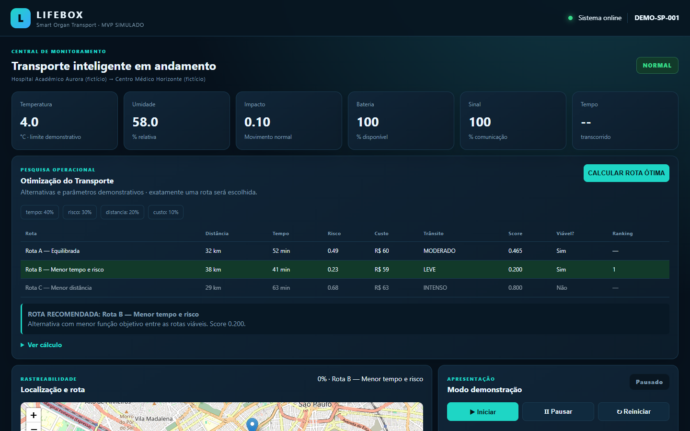
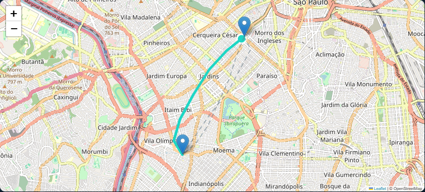
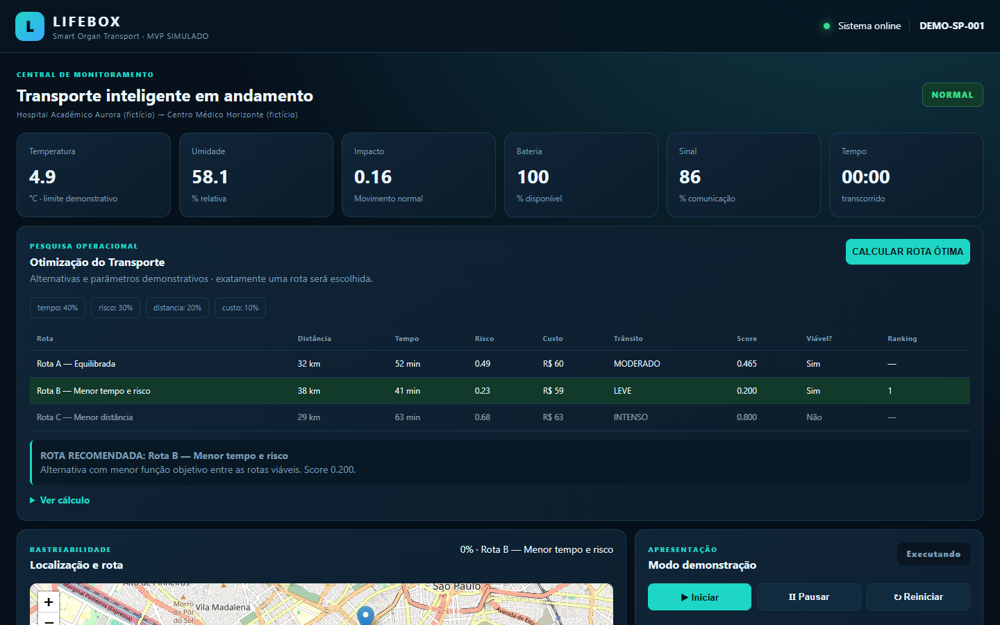
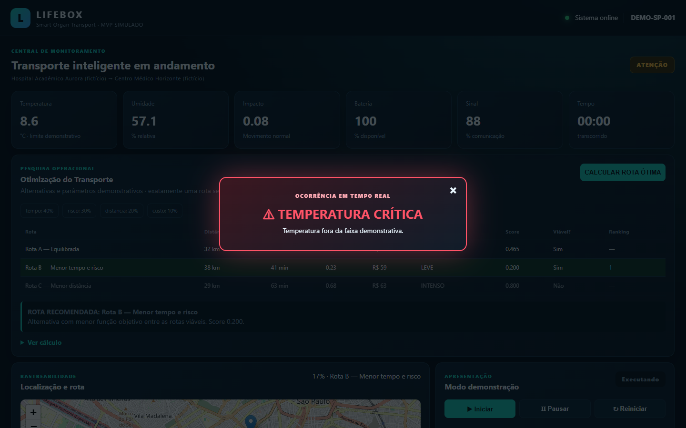
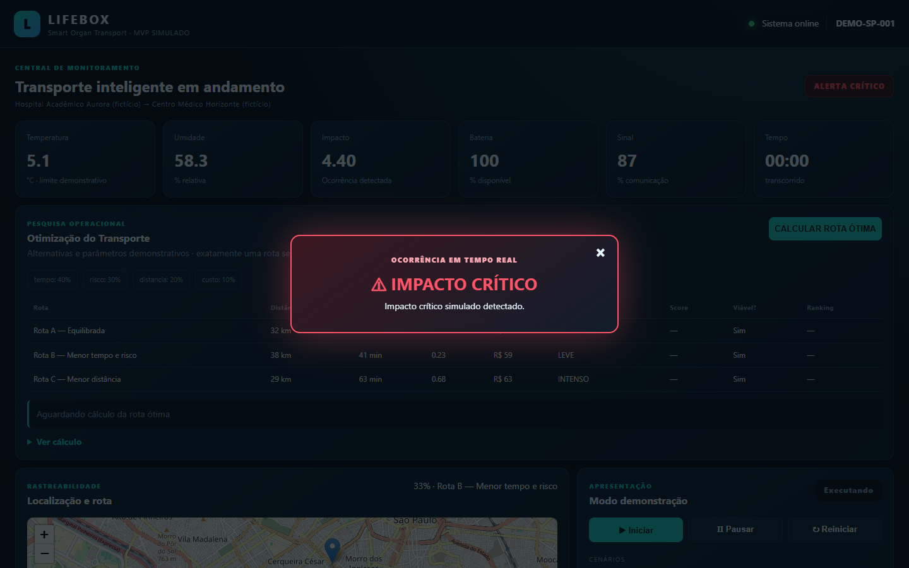
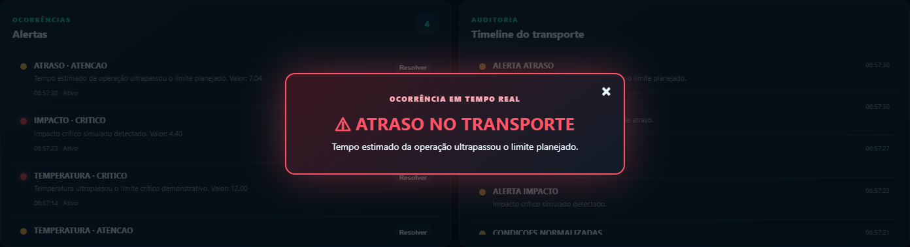
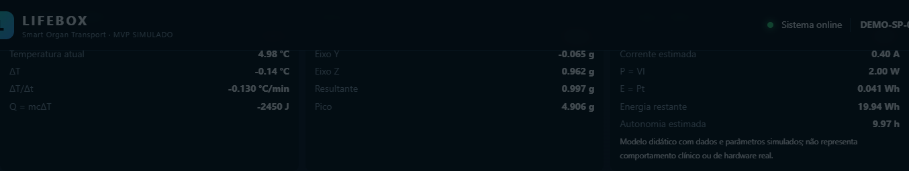
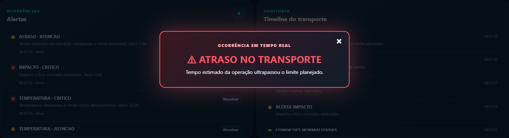
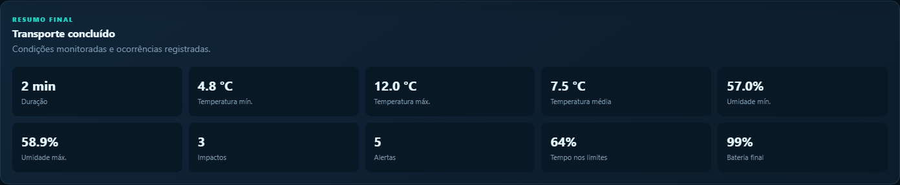
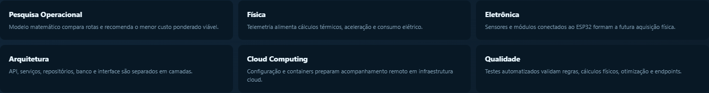

# Evidências visuais do dashboard

Esta pasta deve conter apenas capturas reais do dashboard HTML do LifeBox em funcionamento. Nenhuma imagem de mockup deve ser usada como evidência.

Antes de iniciar a captura, execute o projeto localmente conforme o fluxo já documentado e abra o dashboard no navegador. Salve as imagens em PNG com os nomes abaixo, sem alterar o layout ou os dados fora dos cenários disponíveis no próprio MVP.

| Arquivo esperado | Estado a capturar | O que comprova academicamente |
|---|---|---|
| `01-dashboard-inicial.png` | Sistema online, cards visíveis e Pesquisa Operacional em “Aguardando cálculo da rota ótima”. | Estado inicial seguro: telemetria basal, simulador pausado e decisão de rota ainda não tomada. |
| `02-pesquisa-operacional.png` | Tabela de rotas, rota ótima calculada, ranking e rota recomendada destacada. | Uso do fluxo de Pesquisa Operacional para apoiar a decisão de rota. |
| `03-rastreabilidade.png` | Rota selecionada, posição atual e progresso do transporte. | Rastreabilidade da operação no mapa/painel de progresso. |
| `04-cenario-normal.png` | Telemetria normal, sem alerta crítico. | Operação em condição demonstrativa segura. |
| `05-temperatura-critica.png` | Temperatura alterada, alerta visual e LED/buzzer virtuais ativos. | Cenário crítico térmico e acionamento da lógica digital. |
| `06-impacto-critico.png` | Impacto alterado, alerta visual e LED/buzzer virtuais ativos. | Cenário crítico de impacto e acionamento da lógica digital. |
| `07-atraso.png` | Alerta operacional ATRASO e ocorrência no painel/timeline; LED e buzzer coerentes com a fórmula acadêmica. | Separação entre alerta operacional e atuadores controlados apenas por temperatura/impacto críticos. |
| `08-fisica.png` | ΔT, taxa térmica, Q, aceleração/pico, potência, energia e autonomia. | Cálculos físicos dinâmicos baseados na telemetria simulada. |
| `09-alertas-timeline.png` | Pelo menos um alerta registrado e eventos na timeline. | Histórico de eventos e rastreabilidade de alertas. |
| `10-resumo-final.png` | Transporte finalizado, duração, máximos/mínimos, alertas e bateria final. | Encerramento e resumo operacional da execução. |
| `11-fundamentos-academicos.png` | Cards de PO, Física, Eletrônica, Arquitetura, Cloud e QA. | Integração dos fundamentos acadêmicos do projeto. |

## Procedimento sugerido

1. Abra o dashboard local.
2. Calcule uma rota antes de iniciar o transporte.
3. Use apenas os comandos e cenários disponíveis no Modo demonstração.
4. Capture a tela no estado indicado em cada linha.
5. Salve o PNG nesta pasta com o nome exato da primeira coluna.
6. Revise se textos, cards e alertas estão legíveis antes de usar a imagem como evidência.

## Situação atual

As 11 capturas previstas foram geradas automaticamente a partir do dashboard HTML real em execução localmente. A automação usou os botões e cenários do próprio Modo demonstração; não foram usados mockups nem imagens artificiais.

As capturas focadas em seções específicas usam o tamanho natural da seção para manter os dados legíveis. As capturas gerais usam viewport desktop de 1440×900.

## Capturas reais do dashboard

### 01. Dashboard inicial

Comprova o sistema online, os cards de telemetria e a Pesquisa Operacional aguardando o cálculo.

### 02. Pesquisa Operacional

Comprova a tabela de rotas, o ranking e a rota recomendada após o cálculo.

### 03. Rastreabilidade

Comprova a rota selecionada, a posição atual e o progresso do transporte.

### 04. Cenário normal

Comprova a telemetria em condição demonstrativa normal, sem alerta crítico.

### 05. Temperatura crítica

Comprova a alteração de temperatura, o alerta visual e a ativação dos atuadores virtuais.

### 06. Impacto crítico

Comprova o pico de impacto, o alerta visual e a ativação de LED e buzzer virtuais.

### 07. Atraso

Comprova o registro operacional de ATRASO no painel e na timeline, sem alterar a lógica acadêmica dos atuadores.

### 08. Física

Comprova a atualização dos cálculos de ΔT, taxa térmica, Q, aceleração, potência, energia e autonomia.

### 09. Alertas e timeline

Comprova o histórico de ocorrências e eventos registrados durante a execução.

### 10. Resumo final

Comprova a finalização do transporte, a duração, os extremos monitorados, alertas e bateria final.

### 11. Fundamentos acadêmicos

Comprova a apresentação integrada de Pesquisa Operacional, Física, Eletrônica, Arquitetura, Cloud e Qualidade.
